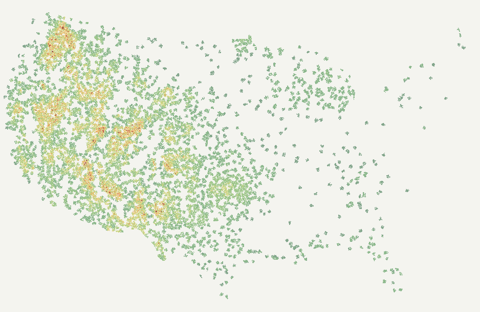

# FireWx-FM

FireWx-FM is a wildfire-specialized gridded model for short-lead **active-fire occupancy prediction** over the Lower 48 United States. The released checkpoint consumes a fixed 16-channel tensor on a 5 km EPSG:5070 grid and predicts the probability that each grid cell contains active fire at a 12-hour lead.

<p align="center">
  
</p>

<p align="center">
  <em>Visualization note: the preview uses discrete speckled raster rendering for readability. Use the probability GeoTIFF for quantitative values.</em>
</p>

<p align="center">
  <b>Task:</b> active-fire occupancy &nbsp; | &nbsp;
  <b>Domain:</b> Lower-48 CONUS &nbsp; | &nbsp;
  <b>Grid:</b> EPSG:5070, 5 km &nbsp; | &nbsp;
  <b>Lead:</b> 12 hours
</p>

## Release Contents

| Component | Path |
|---|---|
| Model checkpoint | [`models/checkpoints/firewxfm_conus_lowposw_noexposure_seed42.pt`](models/checkpoints/firewxfm_conus_lowposw_noexposure_seed42.pt) |
| Input channel contract | [`models/metadata/input_channels.json`](models/metadata/input_channels.json) |
| Normalization statistics | [`models/metadata/input_normalization_stats.json`](models/metadata/input_normalization_stats.json) |
| Inference code | [`firewxfm/`](firewxfm/) |
| Inference contract | [`docs/inference_contract.md`](docs/inference_contract.md) |
| Serving notes | [`docs/serving_notes.md`](docs/serving_notes.md) |
| FM refinement plan | [`docs/fm_refinement_experiment_plan.md`](docs/fm_refinement_experiment_plan.md) |
| Split design | [`docs/split_design.md`](docs/split_design.md) |
| Reproducibility manifest | [`docs/reproducibility_manifest.md`](docs/reproducibility_manifest.md) |
| Data source notes | [`data_sources/DATA_SOURCES.md`](data_sources/DATA_SOURCES.md) |
| HRRR downloader | [`scripts/hrrr_downloader.py`](scripts/hrrr_downloader.py) |
| FIRMS target-hour converter | [`scripts/prepare_firms_target_hour_csvs.py`](scripts/prepare_firms_target_hour_csvs.py) |
| Example output | [`examples/staticfix_conus_candidate_20260812/`](examples/staticfix_conus_candidate_20260812/) |
| Technical report | [`technical_report/A_Wildfire_Foundation_Model_technical_report.pdf`](technical_report/A_Wildfire_Foundation_Model_technical_report.pdf) |
| File checksums | [`release.sha256`](release.sha256) |

Raw source datasets are not redistributed. Users should obtain the required NOAA HRRR, NASA FIRMS, LANDFIRE, Wildfire Risk to Communities, and LandScan resources from the original providers.

## Input Contract

The model expects a tensor with shape `[16, H, W]`. Channel order is fixed.

| Channels | Source | Role |
|---|---|---|
| `0-9` | NOAA HRRR | Dynamic weather fields, including CAPE from the 0-3000 m above-ground layer. |
| `10-11` | Input builder | Dynamic-weather and static-layer validity masks. |
| `12` | LANDFIRE | Fire-behavior fuel model categorical code. |
| `13` | LANDFIRE | Canopy cover. |
| `14-15` | Wildfire Risk to Communities and LandScan | Housing density and population. These channels are zeroed in the final no-exposure serving run. |

Continuous channels use train-split z-score statistics from [`models/metadata/input_normalization_stats.json`](models/metadata/input_normalization_stats.json). The final serving script applies normalization first, then zeros channels `14` and `15`.

## Quick Start

Install the lightweight inference dependencies:

```bash
python -m venv .venv
source .venv/bin/activate
pip install -r requirements.txt
```

Run occupancy inference from a prebuilt 16-channel NumPy stack:

```bash
python -m firewxfm.serve_conus \
  --input-npy /path/to/input_stack_16chw.npy \
  --checkpoint models/checkpoints/firewxfm_conus_lowposw_noexposure_seed42.pt \
  --normalization-stats models/metadata/input_normalization_stats.json \
  --output-npy outputs/firewxfm_occupancy_probability.npy
```

The output is a probability map in `[H, W]` order with values in `[0, 1]`.

## Serving Guidance

Use the default overlap-window inference settings for CONUS-scale maps:

| Setting | Value |
|---|---:|
| Window | `256` |
| Stride | `64` |
| Halo crop | `32` |
| Phase shifts | `0,4,8,12` along both axes |

The 32 by 32 crop size used during training is not the serving tile size. For full-map inference, use overlap windows and phase averaging rather than stitching independent 32 by 32 predictions.

## Example Output

The example output is a Lower-48 CONUS active-fire occupancy prediction using `2026-07-06 12Z` HRRR input and a 12-hour lead to `2026-07-07 00Z`, under the no-exposure serving contract.
The released example applies a USGS-consistency calibration to the raw model map to reduce regional prior artifacts and align the public probability product with same-day USGS Fire Danger Forecast surfaces.

| File | Use |
|---|---|
| [`firewxfm_conus_20260706_t12_usgs_calibrated_probability_5km_lower48.tif`](examples/final_prediction/firewxfm_conus_20260706_t12_usgs_calibrated_probability_5km_lower48.tif) | USGS-consistency calibrated probability GeoTIFF. |
| [`firewxfm_conus_20260706_t12_usgs_calibrated_heatmap.png`](examples/final_prediction/firewxfm_conus_20260706_t12_usgs_calibrated_heatmap.png) | Discrete speckled raster preview. |
| [`firewxfm_conus_20260706_t12_usgs_calibrated_heatmap_rgb.tif`](examples/final_prediction/firewxfm_conus_20260706_t12_usgs_calibrated_heatmap_rgb.tif) | Georeferenced RGB preview with the same display scaling. |

The visual previews use the same probability raster but render it as a display-only, sparse, green-dominant, categorical speckled overlay. The renderer preserves cell-level heterogeneity, uses deterministic jitter and small micro-clusters, avoids Gaussian blur/interpolation, and fragments warm colors into localized yellow, orange, and red pockets. Areas with no overlay are visual omissions for low-salience cells, not missing probability data. Green marks indicate lower displayed 12-hour active-fire occupancy for this date. The probability GeoTIFF is the authoritative quantitative output.

Run the release check from the repository root:

```bash
python scripts/check_release_files.py
```

## Spatial Aggregation

The native model output is a 5 km probability grid. County or sub-county summaries should be produced by aggregating the gridded probabilities after inference.

```bash
python -m spatial_serving.grid_to_polygons \
  --probability-npz outputs/firewxfm_probability_with_coords.npz \
  --polygons /path/to/counties_or_subcounty_units.geojson \
  --id-column GEOID \
  --output outputs/firewxfm_polygon_summary.geojson
```

The polygon adapter reports mean, maximum, 90th percentile, and area fraction above a chosen probability threshold.

## Data Access

The HRRR downloader can fetch public NOAA HRRR files or write a dry-run manifest:

```bash
python scripts/hrrr_downloader.py \
  --start-date 2026-07-06 \
  --end-date 2026-07-06 \
  --hours 12 \
  --forecast-hours 00 \
  --include-idx \
  --output-root downloads/hrrr
```

The full 16-channel stack also requires FIRMS-derived labels for training and static rasters from LANDFIRE, Wildfire Risk to Communities, and LandScan. See [`data_sources/DATA_SOURCES.md`](data_sources/DATA_SOURCES.md).

If FIRMS detections are stored as daily CSV files, convert them to target-hour
label files before building training caches:

```bash
python scripts/prepare_firms_target_hour_csvs.py \
  --daily-dir /path/to/firms_daily_csv \
  --output-dir /path/to/firms_target_hour_csv \
  --config training/configs/stage1_cache_conus_multiyear_template.json
```

## Refinement Experiments

The next FireWx-FM refinement phase is organized around CONUS multi-year training,
cross-year evaluation, region-disjoint evaluation, baselines, ablations, and
reproducibility checks. On UF/HPC, do not run data conversion or cache building
on login nodes; submit the smoke test through Slurm:

```bash
bash slurm/submit_firewxfm_2024_pilot_smoke.sh
```

For non-HPC development machines or interactive compute-node sessions, start
with the Phase-0 audit before building caches:

```bash
python scripts/audit_firewxfm_phase0.py \
  --config training/configs/stage1_cache_conus_multiyear_template.json \
  --output artifacts/manifests/phase0_data_split_audit.json
```

See [`docs/fm_refinement_experiment_plan.md`](docs/fm_refinement_experiment_plan.md)
for the full execution plan.

## Citation

```bibtex
@misc{firewxfm2026,
  title = {A Wildfire Foundation Model},
  author = {Yang, X. and collaborators},
  year = {2026},
  note = {FireWx-FM active-fire occupancy model release},
  url = {https://github.com/yx21e/Wildfire-fm-evaluation-contracts}
}
```

## License and Data Boundary

Code is released for research use under the license in this repository. Raw source data are not redistributed. Users are responsible for obtaining source data and complying with provider terms.
