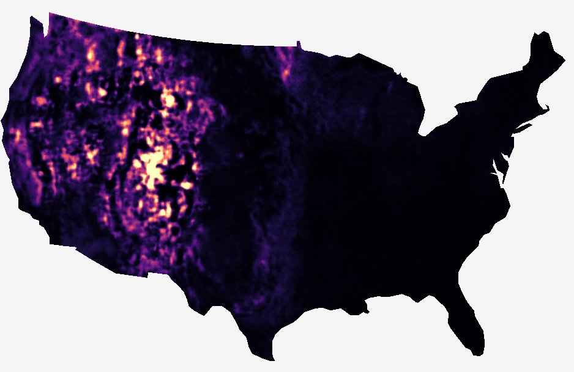
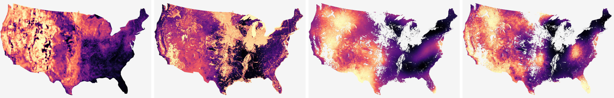

# FireWx-FM

FireWx-FM is a wildfire-specialized gridded reference model for short-lead active-fire occupancy prediction over the Lower 48 United States. The released model consumes a fixed 16-channel weather, fuel, canopy, and exposure tensor on a 5 km EPSG:5070 grid and predicts 12-hour wildfire active-fire occupancy probabilities.

This repository is organized as a model release, not as a paper-output archive. It contains the model code, final serving contract, HRRR download utility, training pipeline, spatial aggregation adapter, and example CONUS prediction outputs.

<p align="center">
  
</p>

<p align="center">
  <b>Native grid:</b> Lower-48 CONUS, EPSG:5070, 5 km &nbsp; | &nbsp;
  <b>Lead:</b> 12 hours &nbsp; | &nbsp;
  <b>Output:</b> active-fire occupancy probability
</p>

## Quick Links

| Item | Link |
|---|---|
| Input channel order | [`models/metadata/input_channels.json`](models/metadata/input_channels.json) |
| Final model manifest | [`models/metadata/final_model_manifest.json`](models/metadata/final_model_manifest.json) |
| Inference contract | [`docs/inference_contract.md`](docs/inference_contract.md) |
| Integration notes | [`docs/integration_notes.md`](docs/integration_notes.md) |
| Data source notes | [`data_sources/DATA_SOURCES.md`](data_sources/DATA_SOURCES.md) |
| HRRR downloader | [`scripts/hrrr_downloader.py`](scripts/hrrr_downloader.py) |
| Final example output | [`examples/final_prediction/`](examples/final_prediction/) |
| External sanity check | [`examples/external_comparison/`](examples/external_comparison/) |
| SHA-256 manifest | [`release.sha256`](release.sha256) |

## What Is Included

| Component | Purpose |
|---|---|
| `firewxfm/` | U-Net architecture and final overlap/phase inference utilities. |
| `models/` | Checkpoint slot, normalization metadata, input-channel contract, and model manifest. |
| `training/` | Cache-building and training code used for the final CONUS 5 km model family. |
| `scripts/hrrr_downloader.py` | Public NOAA HRRR downloader for reproducible weather inputs. |
| `spatial_serving/` | Converts the native 5 km grid output to county or sub-county polygon summaries. |
| `examples/final_prediction/` | Final smoothed CONUS prediction output for the 2024-06-01 demonstration run. |
| `examples/external_comparison/` | Same-scale comparison against public USGS fire-danger products. |

Raw source datasets are not redistributed here. Each source must be obtained from the original provider under its own terms.

## Model Contract

The model expects a single tensor with shape `[16, H, W]`. Channel order matters.

| Channel range | Source family | Notes |
|---|---|---|
| `0-9` | NOAA HRRR | Dynamic weather fields, including CAPE from the 0-3000 m above-ground layer. |
| `10-11` | Input-builder masks | Dynamic weather validity and static-layer validity. |
| `12` | LANDFIRE | Fire-behavior fuel model categorical code. |
| `13` | LANDFIRE | Canopy cover, treated as a continuous static layer. |
| `14-15` | Exposure layers | Housing density and population. These are normalized if stats are supplied, then zeroed in the final no-exposure serving run. |

Continuous input channels are normalized with train-split z-score statistics from `models/metadata/input_normalization_stats.json`. In the released training template this covers channels `0-9`, `13`, `14`, and `15`. Missing values are zero-filled after sanitization, with validity carried separately by mask channels.

## Quick Start

Install the lightweight inference dependencies:

```bash
python -m venv .venv
source .venv/bin/activate
pip install -r requirements.txt
```

Run inference from a prebuilt 16-channel NumPy stack:

```bash
python -m firewxfm.serve_conus \
  --input-npy /path/to/input_stack_16chw.npy \
  --checkpoint models/checkpoints/firewxfm_conus_lowposw_noexposure_seed42.pt \
  --normalization-stats models/metadata/input_normalization_stats.json \
  --output-npy outputs/firewxfm_probability.npy
```

The serving defaults use a 256-cell window, 64-cell stride, 32-cell halo, and a modulo-16 phase ensemble. This is intentional. Do not run the final CONUS map as independent non-overlapping 32 by 32 tiles; that creates tile-center artifacts and visible seams.

## Spatial Outputs

The native model output is a 5 km probability grid. County and sub-county products should be produced by aggregating the gridded probabilities after inference. This keeps the model behavior interpretable and avoids baking administrative-unit choices into the network.

```bash
python -m spatial_serving.grid_to_polygons \
  --probability-npz outputs/firewxfm_probability_with_coords.npz \
  --polygons /path/to/counties_or_subcounty_units.geojson \
  --id-column GEOID \
  --output outputs/firewxfm_county_summary.geojson
```

The adapter reports polygon-level mean, maximum, 90th percentile, and area fraction above a chosen threshold.

## Reproducing Inputs

The HRRR downloader can fetch public NOAA files or write a dry-run manifest:

```bash
python scripts/hrrr_downloader.py \
  --start-date 2024-06-01 \
  --end-date 2024-06-01 \
  --hours 00,06,12,18 \
  --forecast-hours 00 \
  --include-idx \
  --output-root downloads/hrrr
```

The full 16-channel stack also requires FIRMS-derived targets for training and static rasters from LANDFIRE, Wildfire Risk to Communities, and LandScan. See [`data_sources/DATA_SOURCES.md`](data_sources/DATA_SOURCES.md).

## Example Prediction

The final example output is a Lower-48 CONUS prediction for 2024-06-01 using the no-exposure serving contract. The repository keeps both the probability GeoTIFF and a rendered heatmap under [`examples/final_prediction/`](examples/final_prediction/).

| File | Use |
|---|---|
| [`firewxfm_conus_20240601_probability_5km_lower48.tif`](examples/final_prediction/firewxfm_conus_20240601_probability_5km_lower48.tif) | Quantitative probability GeoTIFF. |
| [`firewxfm_conus_20240601_heatmap.png`](examples/final_prediction/firewxfm_conus_20240601_heatmap.png) | Lightweight visual preview. |
| [`firewxfm_conus_20240601_heatmap_rgb.tif`](examples/final_prediction/firewxfm_conus_20240601_heatmap_rgb.tif) | Georeferenced RGB heatmap. |

When the example artifacts are present, run:

```bash
python scripts/check_release_files.py
```

to verify that the checkpoint, metadata, and example outputs are all in place.

## External Sanity Check

We include a same-scale rank comparison against public USGS fire-danger products. These products do not predict the same target as FireWx-FM, so the comparison is a qualitative sanity check rather than an occupancy benchmark.

<p align="center">
  
</p>

## Citation

If this release is useful, cite the associated technical report or repository:

```bibtex
@misc{firewxfm2026,
  title = {A Wildfire Foundation Model},
  author = {Yang, X. and collaborators},
  year = {2026},
  note = {FireWx-FM model release},
  url = {https://github.com/yx21e/Wildfire-fm-evaluation-contracts}
}
```

## License and Data Boundary

Code is released for research use under the license in this repository. Raw NOAA, NASA FIRMS, LANDFIRE, Wildfire Risk to Communities, LandScan, WFIGS, MTBS, and external model-provider datasets are not redistributed. Users are responsible for obtaining source data and complying with provider terms.
